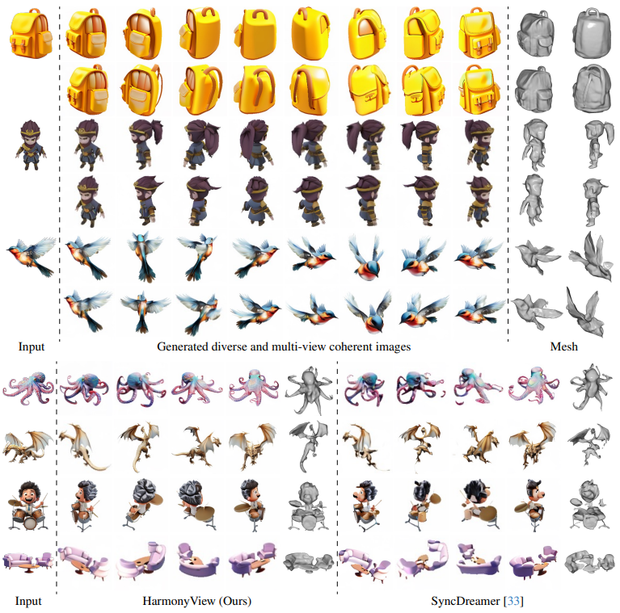

# HarmonyView: Harmonizing Consistency and Diversity in One-Image-to-3D
<!-- Arxiv Link, Project Link -->

<a href="https://arxiv.org/abs/2312.15980"></a>
<a href="https://byeongjun-park.github.io/HarmonyView/"></a>
<a href="https://huggingface.co/spaces/byeongjun-park/HarmonyView"></a>

This repository contains the official pytorch implementation of the paper: "HarmonyView: Harmonizing Consistency and Diversity in One-Image-to-3D".
In this repository, we release codes for the improved version of [Syncdreamer](https://arxiv.org/pdf/2309.03453.pdf) with a novel diffusion sampling technique.

<!-- Please Insert generated Images. -->


**HarmonyView for one-image-to-3D.** HarmonyView generates realistic 3D content using just a single image. It excels at maintaining visual and geometric consistency across generated views while enhancing the diversity of novel views, even in complex scenes.

## Updates

 * **2023.12.26**: Initial Release.


##  Setup
* Please make sure that your gcc version is higher than 8.
```
conda create -n syncdreamer python=3.8
conda activate syncdreamer
pip install -r requirements.txt
pip install git+https://github.com/NVlabs/tiny-cuda-nn/#subdirectory=bindings/torch
pip install git+https://github.com/openai/CLIP.git
```
* Download nvdiffrast from [here](https://github.com/NVlabs/nvdiffrast). Then, install nvdiffrast.
```
cd nvdiffrast
pip install -e .
cd ..
```

* Download checkpoints for ViT-L-14 and syncdreamer-pretrain [here](https://drive.google.com/drive/u/0/folders/1hWfTlG1yMlPlKCkeYL4_1lqJN1-aG1GJ).
* Make sure you have the following models.
```bash
HarmonyView
|-- ckpt
    |-- ViT-L-14.ckpt
    |-- syncdreamer-pretrain.ckpt
```

### Sample image sets and generate meshes
* Download our sampled images and logs for training NeuS [here](https://drive.google.com/drive/u/0/folders/1hWfTlG1yMlPlKCkeYL4_1lqJN1-aG1GJ).
* Make sure you have the following structures.
```bash
HarmonyView
|-- output_gso
    |-- alarm
    |-- backpack
    |-- ...
|-- output_gso_renderer
    |-- alarm-0-neus
    |-- alarm-1-neus
    |-- ...
```

* Or, you can also sample images and train NeuS to get 3D surface if needed.

```bash
object_name="alarm backpack bell blocks chicken cream elephant grandfather grandmother hat leather lion lunch_bag mario
 oil school_bus1 school_bus2 shoe shoe1 shoe2 shoe3 soap sofa sorter sorting_board stucking_cups teapot toaster train turtle"

SCALES1=2.0
SCALES2=1.0
NUM_SAMPLES=4

## Sample Images - Train NeuS - Export Mesh
for object in ${object_name}
do
  python generate.py --ckpt ckpt/syncdreamer-pretrain.ckpt --sample_num ${NUM_SAMPLES} --cfg_scales ${SCALES1} ${SCALES2} --decomposed_sampling --input gso-eval/${object}/000.png --output output_gso/${object} --elevation 30 --crop_size -1
  for id in $(seq ${NUM_SAMPLES})
  do
    python train_renderer.py -i output_gso/${object}/$((id-1)).png -n ${object}-$((id-1))-neus -b configs/neus.yaml -l output_gso_renderer
  done
done
```

### Calculate evaluation metrics

* Evaluate PSNR, SSIM, LPIPS, E_flow, Chamfer Distance, and Volume IoU. We also provide a code for calculating the statistics.

```bash
object_name="alarm backpack bell blocks chicken cream elephant grandfather grandmother hat leather lion lunch_bag mario
 oil school_bus1 school_bus2 shoe shoe1 shoe2 shoe3 soap sofa sorter sorting_board stucking_cups teapot toaster train turtle"
NUM_OBJECTS=30

NUM_SAMPLES=4

## Eval PSNR, SSIM, LPIPS, E_flow, Chamfer Distance, Volume IoU - Calculate Statistics
for object in ${object_name}
do
  python eval_consistency.py --pr output_gso/${object} --gt gso-eval/${object} --name ${object} --num_samples ${NUM_SAMPLES}
  python eval_nvs.py --gt gso-eval/${object} --pr output_gso/${object} --name ${object} --num_samples ${NUM_SAMPLES}
  python eval_CD_score.py --pr output_gso/${object} --name ${object} --num_samples ${NUM_SAMPLES}
  for id in $(seq ${NUM_SAMPLES})
  do
    python eval_mesh.py --pr_mesh output_gso_renderer/${object}-$((id-1))-neus/mesh.ply --gt_mesh gso-eval/${object}/model.obj --gt_name ${object}
  done
done

python gso_nvs_statistics.py --log output_gso --num_samples ${NUM_SAMPLES} --num_objects ${NUM_OBJECTS}
python gso_mesh_statistics.py --log output_gso_renderer --num_samples ${NUM_SAMPLES} --num_objects ${NUM_OBJECTS}
```

* Please refer to the [example scripts](https://github.com/byeongjun-park/HarmonyView/tree/main/gso_evaluation.sh) for detailed instructions how to reproduce our results.

## Your Own Images
### (Optional) pre-processing

* If your image does not contain alpha-channel, predict foreground mask as the alpha channel. 

```bash
python foreground_segment.py --input <image-file-to-input> --output <image-file-in-png-format-to-output>
```

### Sample diverse multi-view images.

```
python generate.py --ckpt ckpt/syncdreamer-pretrain.ckpt \
 --sample_num ${NUM_SAMPLES} --cfg_scales 2 1 --decomposed_sampling \
 --input <image-file-to-input> --output <output-folder-to-output> \
 --elevation ${elevation} --crop_size ${crop_size}
```

* Detailed explanations are described in [SyncDreamer](https://github.com/liuyuan-pal/SyncDreamer).
* ```--sample_num``` : How many instances you want to generate.
* ```--input``` : Path for your own image.
* ```--output``` : Path for output folder.
* ```--elevation``` : An elevation angle of the input image in degree.
* ```--crop_size``` : The input image is resized to 256*256 and the object is resized to crop_size. 

### Train NeuS
* Please select a good generated image set (We provide an example code for ```0.png```) 
```
python train_renderer.py -i <output-folder-to-output>/0.png -n neus -b configs/neus.yaml -l <output-folder-to-output>
```


## Acknowledgments
This codebase borrows from most notably [SyncDreamer](https://github.com/liuyuan-pal/SyncDreamer) and [NeuS](https://github.com/Totoro97/NeuS).
Many thanks to the authors for generously sharing their codes!


## Citation
If you find this repository helpful for your project, please consider citing our work. :)
```
@article{woo2023harmonyview,
  title={HarmonyView: Harmonizing Consistency and Diversity in One-Image-to-3D}, 
  author={Woo, Sangmin and Park, Byeongjun and Go, Hyojun and Kim, Jin-Young and Kim, Changick},
  journal={arXiv preprint arXiv:2312.15980},
  year={2023},
}
```
